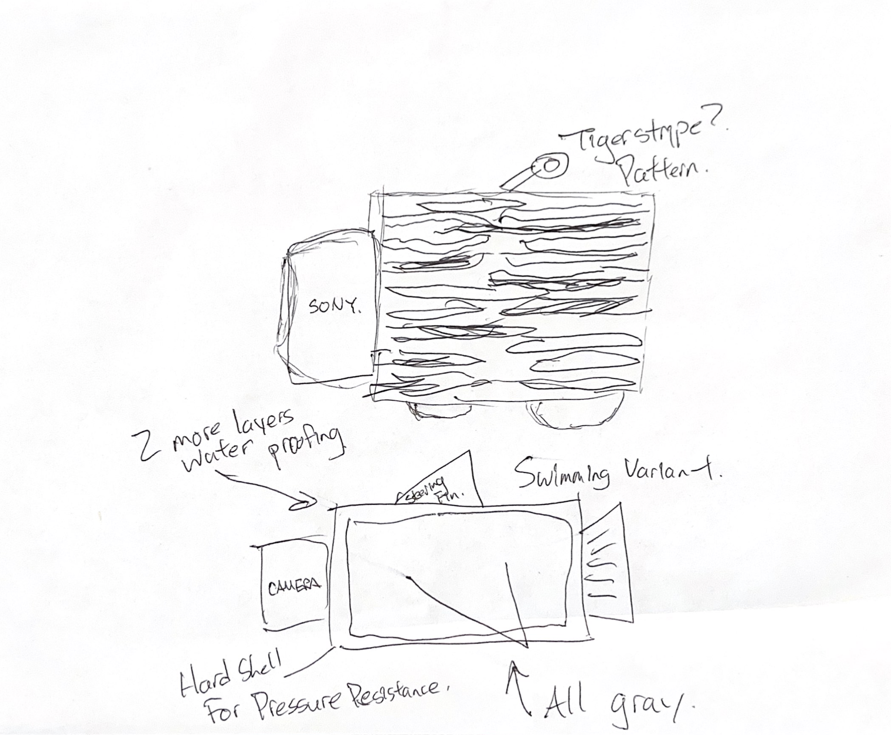
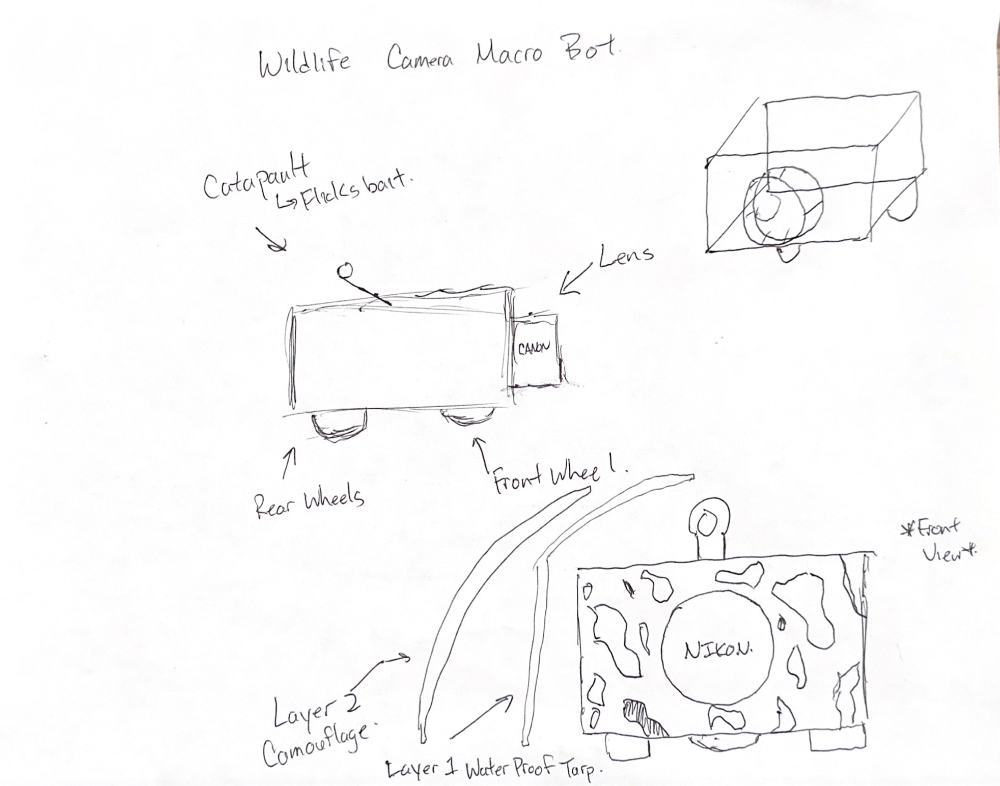
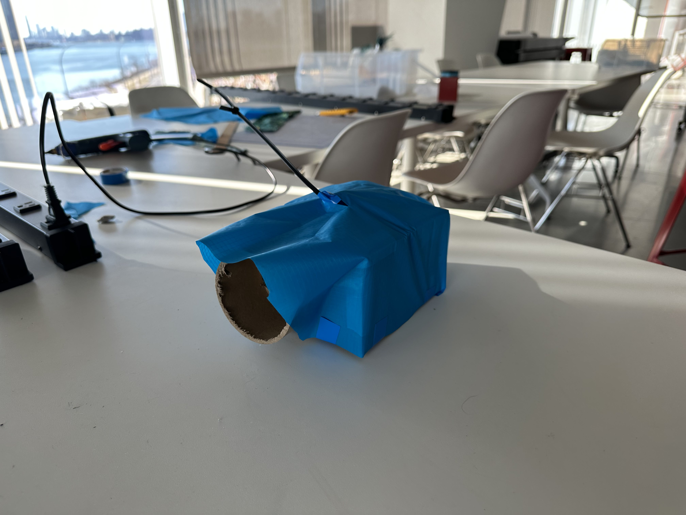
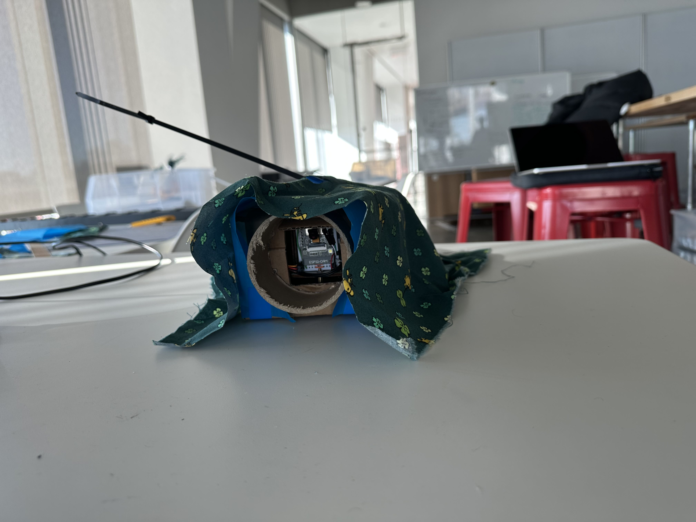
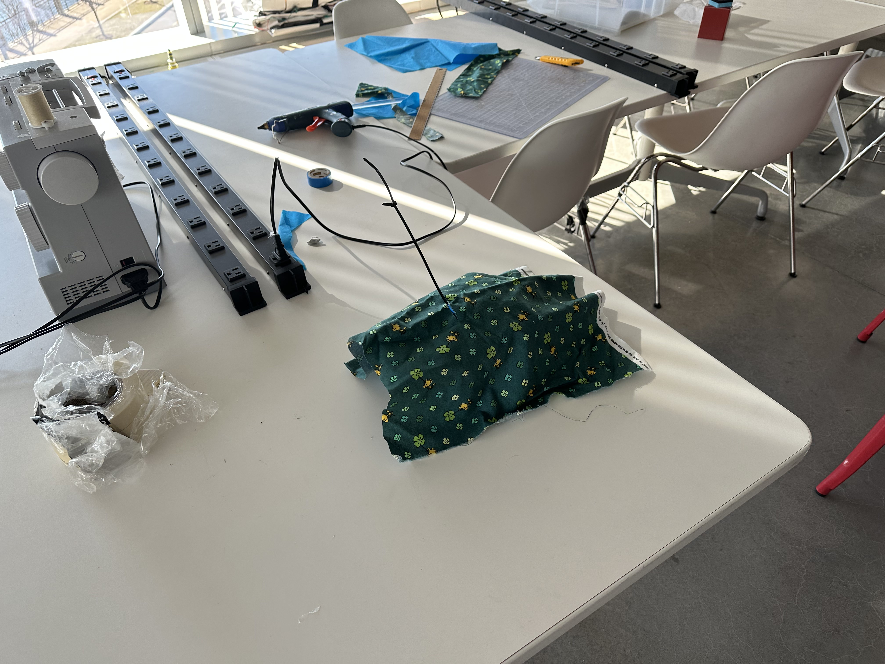

# Then Prototype the Robot
**List the names and NetID for your partners here.**

Tsung-Yin Hsieh - th542@cornell.edu

Jonathan Tan - jmt362@cornell.edu

This week's lab is a continuation of the previous week. We explore the role of both *siting*--the location and activity--in interaction, as well as the *form and appearance* of the robot in the interaction.

## Prep

### For this lab, you will need:
1. Paper
2. Markers/ Pens
3. Scissors/Utility Knifes
4. Smart Phone -- The main required feature is that the phone needs to have a browser and display a webpage.
5. **Found objects and materials** -- You will have to costume your CloneBot so that it fits in the intended setting. These materials can include doll clothes, a paper lantern, a bottle, human clothes, a pillow case, etc. Be creative! We have fabric, just ask!

### Deliverables for this lab are:

0. Fill in the questions along the way!
1. 1 photo of costumed device
2. Reflections on the process
3. Video sketch of 1 prototyped interactions with costumed device
4. Submit the items above in the lab2 folder of your class [Github page], either as links or uploaded files. Each group member should post their own copy of the work to their own Lab Hub, even if some of the work is the same from each person in the group.

### The Report
This README.md page in your own repository should be edited to include the work you have done (the deliverables mentioned above). Following the format below, you can delete everything but the headers and the sections between the **stars**. Write the answers to the questions under the starred sentences. Include any material that explains what you did in this lab hub folder, and link it in your README.md for the lab.

## Lab Overview
For this assignment, you are going to:

A) [Provide feedback to your peers](#part-a-provide-feedback)

B) [Site the interaction](#part-b-site-the-interaction)

C) [Costume the robot](#part-c-costume-the-robot)

D) [Wizard the robot](#part-d-wizard-the-robot)

E) [Video record the interaction](#part-e-record)

Labs are due on Tuesdays before class. Make sure this page is linked to on your main class hub page.

## Part A. Provide Feedback
You and your teammates will be assigned lab 1 submissions from one other group. Go to their github pages, view their videos, and provide them with reactions, suggestions & feedback: explain to them what you saw happening in their video. Guess the scene and the goals of the character. Ask them about anything that wasn’t clear.

**Summarize feedback your feedback here.**

https://github.com/alan7622/Mobile_HRI_Lab_Hub/blob/main/Lab1/Readme.md

Alan Hsieh - amh425@cornell.edu

Cealia Pai - yp332@cornell.edu

We really enjoyed how you utilized the robots to address our daily troubles.  I thought it was funny and creative to get robots to fulfill our daily chores.  One thing about the interactions I am worried about is the complexity of movements for your robot.  Cooking, and grabbing various items seems to be a mechanically difficult task and I am excited to see how you will implement various mechanisms to achieve this!

We reviewed Tsung-Yin Hsieh & Jonathan Tan's lab. In general, we love their ideas. We especially enjoy their HOME IRRIGATION ROBOT where the robot helps water plants. We are curious about how the robot can precisely target plants. It will be annoying it your robot ends up splashing water all over the ground. We guess cameras should be installed and that a well-trained object detection algorithm should come into play.

https://github.com/jamie-cao/Mobile_HRI_Lab_Hub/blob/main/Lab1/jc2974_Readme.md

Jamie Cao (jc2974), Chenran Ning (cn257), Tingkang Zhao (tz275)

Your ideas facing emergency situations such as earthquake rescue and and firefighting are really commendable.  I think this will be a huge use case for robotics in the future!  I'm inspired to rethink about my own ideas in terms of how big the robot will have to be.  Perhaps a earthquake rescue robot must be the size of a mouse!

We think the ideas of the robot are really interesting. We can see that the robot can be used to help people to do some daily tasks, like watering plants and charging phones, which are really helpful. The storyboards are really informative and the videos are fun to watch.

## Part B. Site the interaction

Think about where the interaction you are prototyping is going to occur-- on a desk? on a floor? indoors? outdoors?

Outdoors in the wild!!

What other people and objects are in that space?

We hope the robot is able to explore places without the disturbance of human presence, and so there will be no other people.  We expect wildlife, nature, geology and flora to be in the space.

What activities are going on in that space? What activity is the robot going to be involved in?

The robot will be involved with surviving the elements, withstanding climates and capturing wildlife on camera.

\*\***Sketch and/or take photos of the site(s) you are considering.**\*\*

\*\***Document the activities being considered.**\*\*

- Traversing terrain
- Hiding
- Taking film of wildlife
- Attracting wildlife

\*\***What issues or opportunities arise from the site and activities?**\*\*

- How will we keep the robot safe from rain, snow, sand and grime?
- What happens if the robot is unable to traverse a terrain?

## Part C. Costume the robot

Only now should you start worrying about what the device should look like. Develop one costume so that CloneBot can fit into it's setting.

Think about the setting of the device: is the environment a place where the device could overheat? Is water a danger?

Pick one of the custumes and make it with paper or cardboard or any other material!

\*\***Include sketches of what your robot might look like here.**\*\*

\*\***Include photos of your costumed robot here.**\*\*

\*\***What concerns or opportunities are influencing the way you've designed the robot to look?**\*\*

We have not tested how the cloth or camouflage is effective in various environments.

## Part D. Wizard the Robot
Take a little time to set up the wizarding set-up that allows for someone to remotely control the robot while someone interacts with it. Hint: You can use Zoom to record videos, and you can pin someone’s video feed if that is the scene which you want to record.

\*\***Include your first attempts at recording the set-up video here.**\*\*

https://user-images.githubusercontent.com/6706384/218792125-f09052d9-e03a-46ab-90ff-c0b928b8db18.MOV

Now, hange the goal within the same setting, and update the interaction with the paper prototype.

## Part E. Record

\*\***Take videos of your prototyped interaction.**\*\*

https://user-images.githubusercontent.com/6706384/218792061-aa62fe0c-7b5e-44e6-a55b-08cf56c22b37.MOV

\*\***Please indicate anyone you collaborated with on this Lab.**\*\*
Be generous in acknowledging their contributions! And also recognizing any other influences (e.g. from YouTube, Github, Twitter) that informed your design.

Tsung-Yin Hsieh - th542@cornell.edu

Jonathan Tan - jmt362@cornell.edu

Special thanks to the Lab faculty that helped us with cutting some of the materials using special tools (especially the cardboard tube)

\*\***Document everything here. (Particularly, we would like to see the storyboard and video, although photos of the prototype are also great.)**\*\*

See above.

Labs are due on Tuesdays before class. Make sure this page is linked to on your main class hub page.

### Again, deliverables for this lab are:

0. Fill in the questions along the way!
1. photos of costumed robots
2. Reflections on the process
3. Video sketch of 1 prototyped interactions with the costumed device
4. Submit the items above in the lab2 folder of your class [Github page], either as links or uploaded files. Each group member should post their own copy of the work to their own Lab Hub, even if some of the work is the same from each person in the group.
